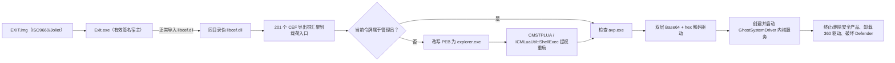

# EXIT / GhostSystemDriver：IDA 9.1 静态分析与 KSword 检测

## 分析边界

- 工具版本：IDA Professional 9.1。
- 方法：只读文件解析、IDA 自动分析、反编译、交叉引用和字符串/导入验证。
- 未执行样本，未调试样本，未挂载 `EXIT.img`，未加载其中的 DLL 或驱动。
- 内嵌驱动仅在分析进程内按 `Base64 -> Base64 -> hex` 还原字节并交给 IDA 9.1；未作为驱动加载。
- 本报告中的行为结论均为静态代码可达性结论，不代表已在真实系统动态触发。

## 样本身份

| 对象 | SHA-256 | 说明 |
|---|---|---|
| `EXIT.img` | `BE92506B5DD88992F1C0257FF443037AFBB4615507F89A4B412C7C5C16DABDD8` | ISO9660/Joliet 卷，卷标 `EXIT` |
| `Exit.exe` | `765D34B234970BE7EB12351051EFF45D5D9CAB515DA07E4615381EACDC672D3B` | Windows 验证为 Wondershare Technology Group Co.,Ltd 有效签名 |
| `libcef.dll` | `C33FD31C5C7D3A2B41C4042FC95AD864B888279D5494A6E590253CE169D97233` | 无有效签名；伪造为 Kerry 相关版本资源 |
| 内嵌驱动 | `292ED18766668B363256BA1C5370F1CABB0D8DC1B53027727D943BC98C78256C` | 42,200 字节，服务名 `GhostSystemDriver` |

镜像根目录还包含三份有效 Microsoft 签名的 VC Runtime DLL。它们未命中本攻击路径的行为规则。

## 攻击路径

### 1. DLL 侧载

`Exit.exe` 的 PE 导入表正常导入大量 CEF API，包括 `cef_execute_process` 和 `cef_initialize`。因此 Windows 加载器会在进入宿主入口 `0x14006BB10` 前解析同目录 `libcef.dll`。镜像提供的 `libcef.dll` 不是正常 CEF 实现，而是代理载荷，构成 DLL 搜索顺序侧载。

### 2. 代理 DLL 与 UAC 绕过

关键 IDA 9.1 标注：

| 地址 | 标注名 | 静态作用 |
|---|---|---|
| `0x180004DF8` | `CefExportPayloadEntry` | CEF 导出桩的公共载荷入口 |
| `0x18000430C` | `MasqueradePebAsExplorer` | 改写 PEB 进程路径、命令行和加载器名称为 `C:\Windows\explorer.exe` |
| `0x180004158` | `RelaunchViaCmstplua` | 通过 CMSTPLUA 提权 moniker 重启当前程序 |
| `0x180003C4C` | `InitializeGhostDriverPaths` | 初始化设备名、服务名和随机临时驱动路径 |
| `0x1800049F4` | `InstallGhostSystemDriverPayload` | 解码、写入、创建并启动内核驱动服务 |

UAC 绕过使用：

- CLSID：`{3E5FC7F9-9A51-4367-9063-A120244FBEC7}`（CMSTPLUA）。
- RIID：`{6EDD6D74-C007-4E75-B76A-E5740995E24C}`（ICMLuaUtil）。
- moniker：`Elevation:Administrator!new:{3E5FC7F9-9A51-4367-9063-A120244FBEC7}`。
- 调用接口虚表 `+0x48` 的 `ShellExec` 方法。

提权/投递前枚举进程；发现 `avp.exe` 时放弃后续载荷，属于针对 Kaspersky 的规避逻辑。

### 3. 内嵌驱动投递

`libcef.dll` 在 `0x180043E80` 保存 150,048 个 UTF-16 字符。静态数据流为：

1. Base64 解码；
2. 再次 Base64 解码；
3. 将连续十六进制文本还原为字节；
4. 得到 42,200 字节 PE 驱动；
5. 写入 `%TEMP%` 下随机五字符 `.sys` 路径；
6. 创建 `GhostSystemDriver` 内核服务（`SERVICE_KERNEL_DRIVER`、`SYSTEM_START`）并启动。

### 4. 内核防护破坏

驱动创建 `\Device\GhostSystemDriver` 与 `\DosDevices\GhostSystemDriver`。设备控制分发接受 `IOCTL 0x898160`，从 METHOD_BUFFERED 输入读取一个 PID，并通过内核句柄终止目标进程。

关键 IDA 9.1 标注：

| 地址 | 标注名 | 静态作用 |
|---|---|---|
| `0x140001640` | `TerminateProcessByPid` | `PsLookupProcessByProcessId`、`ObOpenObjectByPointer`、`ZwTerminateProcess` |
| `0x140001790` | `TerminateProcessWithTimeout` | 在系统线程中终止目标并设置等待超时 |
| `0x1400018A0` | `TerminateSecurityProductTargets` | 遍历 46 个安全相关进程目标 |
| `0x140001D00` | `Unload360DriversAndDeleteKeys` | 卸载名称以 `360` 开头的驱动并删除注册表树 |
| `0x1400020B0` | `DefenseImpairmentWorker` | 每秒执行进程终止和 Defender/360 破坏 |
| `0x1400024A0` | `DeviceControlTerminatePid` | 处理 `IOCTL 0x898160` |

驱动持续执行以下操作：

- 将 `WdFilter`、`WdBoot`、`WdNisDrv` 的 `Start` 写为 `4`；
- 将 Defender `TamperProtection` 写为 `0`；
- 将 `DisableRealtimeMonitoring` 写为 `1`；
- 删除 `SYSTEM\CurrentControlSet\Services\WinDefend`；
- 终止 Microsoft Defender、360、Avast、AVG、腾讯电脑管家、火绒、趋势科技等相关进程；
- 对 `ZhuDongFangYu.exe`、`360tray.exe`、`360sd.exe`、`360Safe.exe`、`360rps.exe`、`360rp.exe`、`MsMpEng.exe`、`NisSrv.exe` 在终止后继续删除映像文件；
- 调用 `ZwUnloadDriver` 卸载 basename 以 `360` 开头的已加载驱动；
- 删除 `\Registry\User\Software\360`、`\Registry\Machine\SOFTWARE\360` 和 `\Registry\Machine\SOFTWARE\WOW6432Node\360`。

卸载例程尝试删除 `\DosDevices\MicrosoftSystemDriver`，而非实际创建的 `GhostSystemDriver` 链接，疑似实现错误。

## MITRE ATT&CK 映射

| 技术 | 映射依据 |
|---|---|
| T1574.002 DLL Side-Loading | 有效签名宿主导入同目录伪 `libcef.dll` |
| T1548.002 Bypass User Account Control | CMSTPLUA elevation moniker 与 ICMLuaUtil::ShellExec |
| T1036 Masquerading | 改写 PEB 为 `explorer.exe` |
| T1140 Deobfuscate/Decode Files | 双层 Base64 和十六进制载荷还原 |
| T1543.003 Windows Service | 创建并启动内核驱动服务 |
| T1562.001 Impair Defenses | 终止安全产品、卸载驱动、禁用 Defender |
| T1112 Modify Registry | 修改/删除 Defender 与 360 注册表配置 |
| T1070.004 File Deletion | 删除部分安全产品映像文件 |

## KSword 检测器

原生规则 ID 为 `KSWORD.EXIT_GHOST_CHAIN.V1`，集成在 ScannerDock 的结构化扫描流程：

- 直接扫描 PE 时，在同一个稳定文件快照上检查代理 DLL 或驱动行为；
- 扫描 `.img/.iso` 时自行解析 ISO9660/Joliet，不调用系统挂载；
- 容器成员仅以父快照中的 `offset + size` 范围传给检测器，不落地；
- 内嵌驱动仅在内存中严格执行 `UTF-16 Base64 -> Base64 -> hex -> PE` 解码；
- UI 展示规则评分、攻击阶段、MITRE 技术、对象和可复核原始偏移；解码后对象不会伪装成原始文件偏移。

判定阈值为 60/100，并额外要求以下关键组合之一：

1. 驱动服务投递 + CMSTPLUA 提权或内嵌驱动解码；
2. Defender 注册表破坏 + 安全产品进程终止。

单个 `libcef.dll` 名称、单个进程名、单个服务名或已知 SHA-256 都不会独立触发最终恶意判定。便携规则见 `tools/detection_rules/exit_ghostsystemdriver.yar`。

## 验证范围

- 合成 ISO9660：验证目录遍历、双端字段校验、成员边界和不挂载路径；
- 合成代理 DLL/驱动字节：验证 CMSTPLUA、PEB 伪装、双层解码和防护破坏证据组合；
- 良性合成 ISO：验证低于阈值；
- 损坏 ISO：验证小端/大端区段不一致时安全拒绝；
- 真实 `EXIT.img`：只允许用 KSword/自测程序进行只读扫描，禁止执行成员。

实际验证结果：

- 原生扫描器完整自测退出码为 `0`，PE、ELF、Mach-O、ISO9660、损坏输入和攻击路径断言全部通过；
- 对原始 `EXIT.img` 的只读扫描识别为 `ISO9660`，规则评分 `100/100`，返回 11 条静态证据；
- 真实镜像验证同时命中 `container.libcef_sideload_pair` 和解码后驱动的
  `driver.defender_registry`，证明容器关联与内存解码链均进入最终判定；
- YARA 4.5.4 编译成功，原始镜像命中 `KSword_EXIT_ISO_Attack_Path`；
- KSword 主程序以 `Release/x64` 完整重建成功，`BUILD_RESULT=SUCCESS`、`EXIT_CODE=0`，
  构建时 i18n 审计通过；最终 `Ksword5.1.exe` 为 17,278,360 字节，SHA-256 为
  `E71EE6EDD7BBCD628E6A3ECD28F25929182C5C2EF5A01C2DE20B06E3A41F0D09`。

动态持久化结果、驱动在具体 Windows 版本上的实际加载结果、签名策略绕过结果和真实终止效果均未验证，也不应从本次静态分析推断为已发生。
